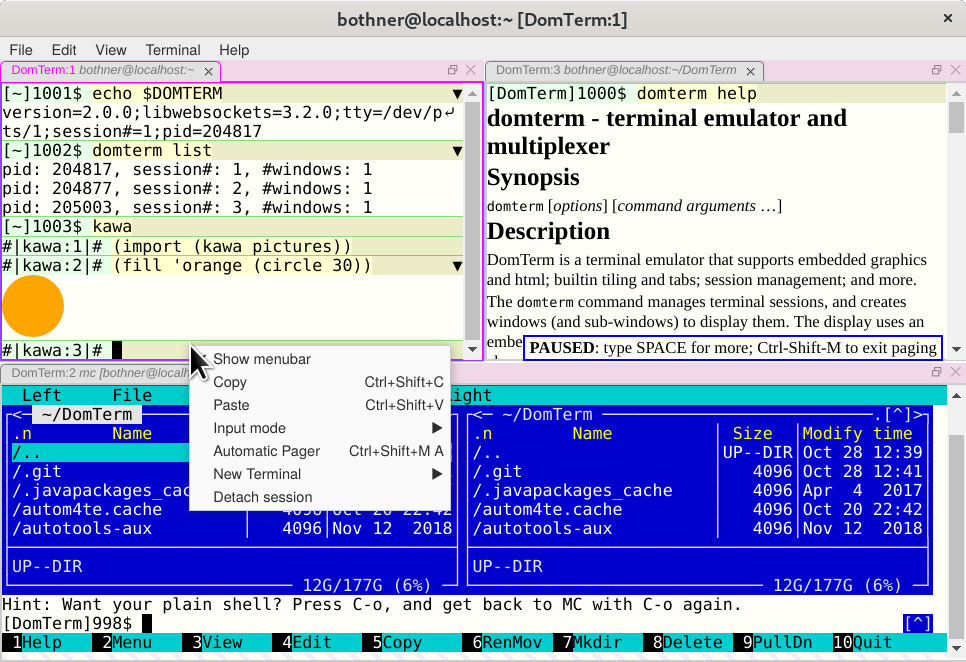

# DomTerm - a terminal emulator and console using DOM and JavaScript

DomTerm is a combined terminal emulator and REPL console using web
technlogies - i.e. JavaScript and DOM: Users can type commands which
gets sent to an application, which evaluates the command, and displays
the results, typically in some kind of type-script format.

See the [home page](https://domterm.org/) for more information,
including [list of features with many screenshots](http://domterm.org/Features.html).

Recent advances:

* There is now a DomTerm mailing list at domterm-discuss@domterm.org
with an [information page](http://lists.domterm.org/listinfo.cgi/domterm-discuss-domterm.org)
and [archives](http://lists.domterm.org/pipermail/domterm-discuss-domterm.org/).

* The qtdomterm application is designed to replace your favorite
standalone terminal emulator program. It uses QtWebEngine.

* Mouse support using xterm protocols.

* You can save the console file as an offline-readable (x)html-file.

* Pretty-printing (Common Lisp style) is now handled by DomTerm.
This means automatic re-flow on window re-size.
